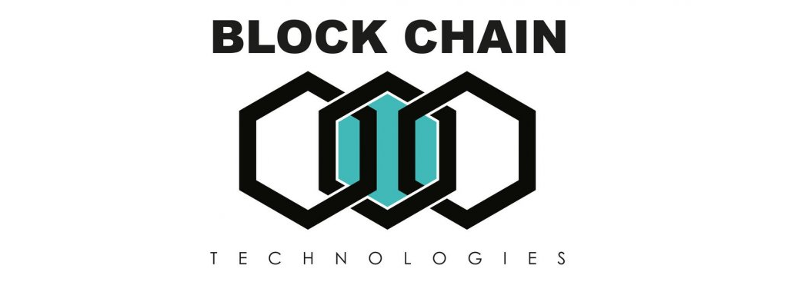

<div align="center">
  
</div>

# Blockchain
Welcome to the Blockchain track ! \o/

The goal of this series of projects is to build a basic Blockchain/Cryptocurrency
entirely in C, and from scratch! Its going to be a lot of work, and were going to
go through this step by step.


## Topics
- What blockchain is
- How Cryptography works
- Data Structures concepts for Blockchain
- Block mining concepts for Blockchain

## Requirements
- Ubuntu 14.04 LTS
- C programs and functions will be compiled with gcc 4.8.4
- For this project, you will need to [Install the OpenSSL library](https://help.ubuntu.com/community/OpenSSL#Practical_OpenSSL_Usage) (if not already
  installed).

## Installation
When you are in your Linux Shell (CLI): Using git command clone the project from its URL.  
Example:
```bash
vagrant@gogomillan$
vagrant@gogomillan$ git clone https://github.com/gogomillan/holbertonschool-blockchain.git
Cloning into 'holbertonschool-blockchain'...
remote: Enumerating objects: 390, done.
remote: Counting objects: 100% (390/390), done.
remote: Compressing objects: 100% (271/271), done.
remote: Total 390 (delta 253), reused 241 (delta 110), pack-reused 0
Receiving objects: 100% (390/390), 451.97 KiB | 0 bytes/s, done.
Resolving deltas: 100% (253/253), done.
Checking connectivity... done.
vagrant@gogomillan$ ls -al
total 28
drwxrwxr-x  3 vagrant vagrant 4096 Apr 13 05:41 .
drwxr-xr-x 14 vagrant vagrant 4096 Apr 13 05:40 ..
drwxrwxr-x  5 vagrant vagrant 4096 Apr 13 05:41 holbertonschool-blockchain
vagrant@gogomillan$ cd holbertonschool-blockchain/
vagrant@gogomillan$ ls -al
total 32
drwxrwxr-x 5 vagrant vagrant 4096 Apr 13 05:41 .
drwxrwxr-x 3 vagrant vagrant 4096 Apr 13 05:41 ..
drwxrwxr-x 2 vagrant vagrant 4096 Apr 13 05:41 assets
drwxrwxr-x 4 vagrant vagrant 4096 Apr 13 05:41 crypto
drwxrwxr-x 8 vagrant vagrant 4096 Apr 13 05:41 .git
-rw-rw-r-- 1 vagrant vagrant  430 Apr 13 05:41 .gitignore
-rw-rw-r-- 1 vagrant vagrant 1076 Apr 13 05:41 LICENSE
-rw-rw-r-- 1 vagrant vagrant 1833 Apr 13 05:41 README.md
vagrant@gogomillan$
```

## Projects
### [Blockchain crypto](crypto/.#readme)
### [Blockchain data structure](blockchain/v0.1/.#readme)
### [Blockchain block mining](blockchain/v0.2/.#readme)

## Author
Gonzalo Gomez Millan - <gonzalo.gomez.millan@gmail.com>
[](https://github.com/gogomillan)
[](https://twitter.com/gogomillan)
[](https://linkedin.com/in/gogomillan)

## Licence
MIT 
\[ [Read](LICENSE) \]
