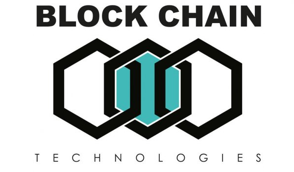

  

# Blockchain
Welcome to the Blockchain track ! \o/

The goal of this series of projects is to build a basic Blockchain/Cryptocurrency
entirely in C, and from scratch! Its going to be a lot of work, and were going to
go through this step by step.

## Topics
- What blockchain is
- How Cryptography works
- Data Structures concepts for Blockchain
- Block mining concepts for Blockchain

## Requirements
- Ubuntu 14.04 LTS
- C programs and functions will be compiled with gcc 4.8.4
- For this project, you will need to [Install the OpenSSL library](https://help.ubuntu.com/community/OpenSSL#Practical_OpenSSL_Usage) (if not already
  installed).

## Projects
1. [Blockchain crypto](crypto/.#readme)
2. [Blockchain data structure](blockchain/v0.1/.#readme)
2. [Blockchain block mining](blockchain/v0.2/.#readme)

## Author
Gonzalo Gomez Millan - [gonzalo.gomez.millan@gmail.com](mailto:gonzalo.gomez.millan@gmail.com)  

## Licence
MIT 
\[ [Read](LICENSE) \]
